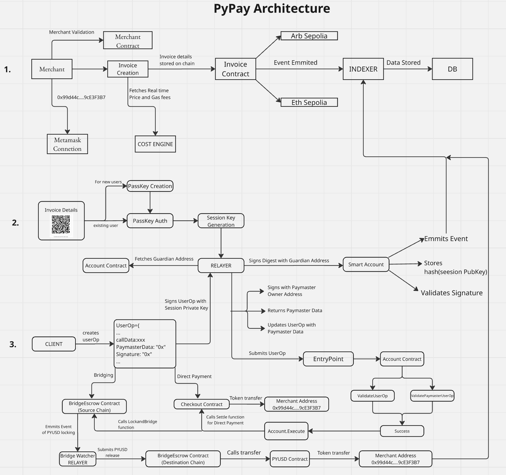

# PyPay - Passwordless Cross-Chain PYUSD Payments

A walletless, gasless checkout: buyers tap or scan an NFC/QR invoice, confirm with a passkey (WebAuthn), and pay a registered merchant in PYUSD on the cheapest available network. An ERC‑4337 paymaster sponsors gas; ephemeral session keys reduce repeated prompts. If the buyer’s funds live on another chain, the app can automatically re-route and bridge the payment as needed.



## Protocol Overview

PyPay enables passwordless, gasless PYUSD payments: customers authenticate with WebAuthn passkeys while merchants use EOA wallets. The system uses ERC‑4337 counterfactual accounts (CREATE2) plus short‑lived session keys to minimize user friction; a paymaster sponsors gas and a cost engine routes payments (direct vs bridge). For cross‑chain transfers a BridgeEscrow + relayer perform inventory‑backed lock-and-release settlement.

**Technical Implementation:** Uses EIP-4337, EIP-2612/Permit2, EIP-712, EIP-1271, and EIP-1967. Core on‑chain pieces: AccountFactory, TapKitAccount , Checkout , TapKitPaymaster, BridgeEscrow. 
Off‑chain: relayer, indexer, cost‑engine.

**Architecture:** Smart contracts include Account Factory, Checkout, Paymaster, Bridge Escrow, and Session Policy. Backend services comprise Indexer (event monitoring), Relayer (UserOp submission), and Cost Engine (gas calculations). Frontend uses Next.js merchant portal and customer checkout with WebAuthn integration.

**Tech Stack:** Solidity 0.8.28, Foundry, ERC-4337, PERMIT2, Solady, OpenZeppelin; TypeScript, Fastify, Prisma, PostgreSQL, Viem, Next.js 15, React 18, TailwindCSS, Wagmi v2, WebAuthn,Alchemy.

**Supported Chains:** Testnet (Arbitrum Sepolia, Ethereum Sepolia). 


## Documentation

- **[Technical Reference](docs/TECHNICAL_REFERENCE.md)** - Architecture and implementation details
- **[Technical Flow](docs/TECHNICAL_FLOW.md)** - Complete payment flow with visual diagram
- **[Local Testing Guide](docs/LOCAL_TESTING_GUIDE.md)** - How to test the system locally
- **[Testnet Deployment Guide](docs/TESTNET_DEPLOYMENT_GUIDE.md)** - Step-by-step deployment guide


## Live testnet addresses

### Arbitrum Sepolia (Arbiscan)

- REGISTRY: [0xB65901d4D41D6389827B2c23d6C92b29991865D9](https://sepolia.arbiscan.io/address/0xB65901d4D41D6389827B2c23d6C92b29991865D9)
- INVOICE: [0x7c3ACA4B28be70C15bb4C3A8a93CE7dF64713ED0](https://sepolia.arbiscan.io/address/0x7c3ACA4B28be70C15bb4C3A8a93CE7dF64713ED0)
- CHECKOUT: [0x96AD79AB348336cFA881C9e0E582d25968799485](https://sepolia.arbiscan.io/address/0x96AD79AB348336cFA881C9e0E582d25968799485)
- PAYMASTER: [0xC54bBF5A6FC2D72A25985eba2eb385b3340c29a6](https://sepolia.arbiscan.io/address/0xC54bBF5A6FC2D72A25985eba2eb385b3340c29a6)
- BRIDGE_ESCROW: [0xC531d4D522Bb9DAFcCdED9d155C09502Cf0385B6](https://sepolia.arbiscan.io/address/0xC531d4D522Bb9DAFcCdED9d155C09502Cf0385B6)
- ACCOUNT_FACTORY: [0x19da58bD831E2A54De8716aCa2B1bb27dA450cB9](https://sepolia.arbiscan.io/address/0x19da58bD831E2A54De8716aCa2B1bb27dA450cB9)
- PYUSD: [0x637A1259C6afd7E3AdF63993cA7E58BB438aB1B1](https://sepolia.arbiscan.io/address/0x637A1259C6afd7E3AdF63993cA7E58BB438aB1B1)
- SMART_ACCOUNT: [0xc5603937d2056a05A7E71D39f2E58cEf18C3271a](https://sepolia.arbiscan.io/address/0xc5603937d2056a05A7E71D39f2E58cEf18C3271a)

### Ethereum Sepolia (Etherscan)

- REGISTRY: [0xa47749699925e9187906f5a0361d5073397279b3](https://sepolia.etherscan.io/address/0xa47749699925e9187906f5a0361d5073397279b3)
- INVOICE: [0x48935538CEbdb57b7B75D2476DC6C9b3A1cceDD6](https://sepolia.etherscan.io/address/0x48935538CEbdb57b7B75D2476DC6C9b3A1cceDD6)
- CHECKOUT: [0xF57690CD5f91257E76C9f636de9B1243c4a0fD8e](https://sepolia.etherscan.io/address/0xF57690CD5f91257E76C9f636de9B1243c4a0fD8e)
- PAYMASTER: [0xe6257bd26941cB6C3B977Fe2b2859aE7180396a4](https://sepolia.etherscan.io/address/0xe6257bd26941cB6C3B977Fe2b2859aE7180396a4)
- BRIDGE_ESCROW: [0xfE5D99899A40C9bF4189bebFF7bd23CB2d7eFDE9](https://sepolia.etherscan.io/address/0xfE5D99899A40C9bF4189bebFF7bd23CB2d7eFDE9)
- ACCOUNT_FACTORY: [0x15FfbD328C9A0280027E04503A3F15b6bdea91e5](https://sepolia.etherscan.io/address/0x15FfbD328C9A0280027E04503A3F15b6bdea91e5)
- PYUSD: [0xCaC524BcA292aaade2DF8A05cC58F0a65B1B3bB9](https://sepolia.etherscan.io/address/0xCaC524BcA292aaade2DF8A05cC58F0a65B1B3bB9)
- SMART_ACCOUNT: [0xe2c55e352C5AfE9acF2AEbF9f48d631672658002](https://sepolia.etherscan.io/address/0xe2c55e352C5AfE9acF2AEbF9f48d631672658002)


## Quick Start

### Prerequisites
- Node.js 20+
- pnpm 8+
- Foundry
- PostgreSQL

### Setup
```bash
git clone https://github.com/arunabha003/PYPay.git
cd PYPay
pnpm install
cp env.example .env
cd apps/web
cp env.local.example .env.local
# Configure your environment variables
```


## Testing

```bash
# Contract tests
cd packages/contracts
forge test -vvv

```

## Contributing

1. Fork the repository
2. Create your feature branch
3. Commit your changes
4. Push to the branch
5. Open a Pull Request

## License

MIT License - see LICENSE file for details.
